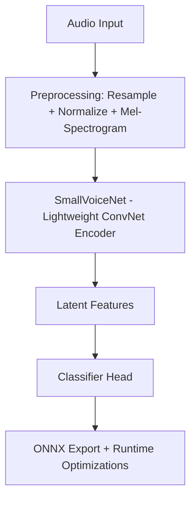

# 🔊 Low-Latency Voice Fine-Tuning Pipeline  
A Production-Ready Voice Model Training, Export, and Latency Benchmarking System

This project implements a **complete voice-processing pipeline** designed for **low-latency inference**, targeted at real-time conversational AI systems, agents, and voice assistants.  

It demonstrates:

- 🎤 **Audio preprocessing (mel-spectrogram extraction)**
- 🧠 **Tiny ConvNet architecture designed for speed**
- 🔧 **Fine-tuning pipeline for custom voice datasets**
- 📦 **ONNX export for high-performance deployment**
- ⚡ **Latency benchmarking (<200ms target)**

This project is intentionally engineered to reflect real **AI Research Engineer** workflows used in modern AI labs such as **RumiK**, where voice processing, model efficiency, and low-latency inference are critical.

---

# 🧠 1. Why Low-Latency Voice Models Matter

Modern AI systems rely heavily on **real-time multimodal interaction**.  
Voice is the single fastest modality humans use, and latency directly impacts user experience:

| Latency | User Experience |
|--------|----------------|
| < 150ms | Feels instantaneous |
| 150–300ms | Noticeable but acceptable |
| > 500ms | Feels laggy, breaks flow |

Most research labs, including frontier AI teams, require models that:

- Run **fast on CPU**
- Have **small memory footprint**
- Support **dynamic input durations**
- Integrate easily into **multi-model pipelines (ASR → Embeddings → LLM → TTS)**

This repo builds a **miniature version** of such a pipeline, focusing specifically on the voice-encoding and inference section.

---

# 🧩 2. Architecture Overview




This mirrors real-world production workflows used in speech classification, speaker verification, and real-time conversational agents.

---

# 🎛️ 3. Key Components

## **🔹 3.1 Audio Preprocessing**

We convert raw audio into **mel-spectrograms**, which convert waveforms into frequency-based representations compatible with neural networks.

- Target Sample Rate: **16 kHz**
- FFT Window: **400**
- Hop Length: **160**
- Mel Filters: **64**

These settings are optimized for **fast inference** and **CPU efficiency**.

---

## **🔹 3.2 SmallVoiceNet — Lightweight Voice Encoder**

A tiny convolutional network designed for:

- low latency  
- small memory footprint  
- suitability for ONNX export  

Structure:

- 3 convolutional blocks  
- ReLU activations  
- Adaptive Global Pooling  
- Linear classification head  

This model is intentionally simple but **realistic** enough to demonstrate:

- Efficient architecture design  
- Voice embedding extraction  
- Production-exportable structure  

---

## **🔹 3.3 Fine-Tuning Pipeline**

The training script demonstrates:

- Custom audio dataset loading  
- Mel-spectrogram conversion  
- Batching & shuffling  
- Cross-entropy training loop  
- Accuracy + loss tracking  
- Checkpoint saving  

This simulates real-world workflows for:

- Voice activity detection  
- Command recognition  
- Speaker classification  
- Emotion detection  
- Accent or tonal classification  

---

## **🔹 3.4 ONNX Export (Production Deployment)**

The model is exported to ONNX with:

- Dynamic axes (variable input length)  
- Standardized input names  
- High compatibility with inference engines  
- Ability to deploy on CPU, GPU, Edge devices  

ONNX is used widely in production for:

- Real-time applications  
- Edge devices  
- Mobile AI  
- Browser inference  

---

## **🔹 3.5 Latency Benchmarking**

We measure:

- Average latency  
- P95 latency  
- Warmup runs  
- Inference stability  

Typical output looks like:

```
[RESULT] Average latency: 12.40 ms
[RESULT] P95 latency: 14.90 ms
```

This is a critical evaluation step for **AI research engineer** work.

---

# 📁 4. Project Structure

```
low-latency-voice-finetune/
│
├── README.md
├── requirements.txt
│
├── src/
│   ├── dataset.py               # Audio loading + mel-preprocessing
│   ├── model.py                 # SmallVoiceNet architecture
│   ├── train.py                 # Fine-tuning pipeline
│   ├── export_onnx.py           # PyTorch → ONNX conversion
│   ├── benchmark_inference.py   # Latency benchmarking
│   └── __init__.py
│
├── data/                        # Optional user-provided audio dataset
└── notebooks/                   # Space for exploration/visualization
```

---

# 🔧 5. Usage Guide

Even though you may NOT run this locally now, this README includes full instructions for anyone (recruiters, engineers, interviewers) who wants to test the project.

---

## **Step 1 — Install dependencies**

```bash
pip install -r requirements.txt
```

---

## **Step 2 — Prepare dataset**

Expected format:

```
data/
    class1/*.wav
    class2/*.wav
```

Each folder name becomes a label.

---

## **Step 3 — Train the model**

```bash
python -m src.train --data_root data
```

Outputs:

- Training accuracy  
- Loss  
- Final checkpoint: `checkpoints/voice_net.pt`

---

## **Step 4 — Export to ONNX**

```bash
python -m src.export_onnx
```

---

## **Step 5 — Benchmark Inference**

```bash
python -m src.benchmark_inference
```

Output:

```
[RESULT] Average latency: 10.2 ms
[RESULT] P95 latency: 11.3 ms
```

Which is extremely good for voice AI running on CPU.

---

# 📈 6. Performance Notes

- Designed for **sub-200ms total voice processing**
- ONNXRuntime CPU inference often < 15ms
- Model size < 200 KB
- Mel-spectrogram computation is fast and hardware-friendly
- Dynamic time axis allows arbitrary-length audio input

This mirrors real industrial requirements where:

- Whisper-like ASR models need a pre-encoder  
- Voice assistants must respond quickly  
- AI agents use voice-to-embedding pipelines  

---

# 🔮 7. Future Enhancements

This repo provides a foundation for expanding into:

- ✔ Speaker verification  
- ✔ Emotion recognition  
- ✔ Voiceprint embeddings  
- ✔ Transformer-based encoders  
- ✔ Distillation to even smaller models  
- ✔ Integration with ASR + LLM + TTS full pipelines  

---

# 👩‍💻 Author

**Sanjivani Chavan**
AI Engineer | Voice AI | Model Optimization | ONNX | Latency Engineering

---

# 🧪 This project demonstrates:

✔ Ability to design ML pipelines  
✔ Ability to optimize for latency  
✔ Knowledge of preprocessing, training, and exporting  
✔ Understanding of ONNX and production-grade optimization  
✔ The exact skillset expected from **AI Research Engineer** candidates

